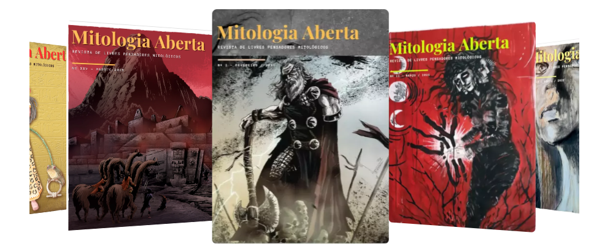

# 🌌 Revista Mitologia Aberta

> Uma Revista Eletrônica, Colaborativa e de Distribuição Gratuita para amantes da mitologia!
[Acesse agora](https://www.mitologiaaberta.com.br/) 🌐

---

---

## ✨ Sobre o Projeto

A **Mitologia Aberta** é um espaço dedicado aos **livres pensadores da mitologia**.
Nossa missão é criar uma **comunidade colaborativa** de pessoas que compartilham paixão por deuses, lendas e culturas ancestrais.

**Principais características:**

- 📖 **Revista digital e gratuita:** acessível para todos.

- 👥 **Colaborativa:** qualquer apaixonado por mitologia pode publicar.

- 🏛️ **Sem barreiras acadêmicas:** basta amar o tema!

- 🌍 **Multitemática:** abrange mitologias grega, nórdica, egípcia, oriental, indígena e muito mais.

---

## 📚 Como Colaborar

Quer ver seu artigo ou ensaio publicado? É simples:

1. ✍️ Escreva sobre mitologia, lendas ou análises culturais.

2. 📤 Envie seu texto para nossa equipe editorial.

3. 🎉 Veja sua contribuição na próxima edição da revista.

> 💡 Dica: Não precisa ser especialista. Se você ama mitologia, já faz parte da nossa comunidade!

---

## 🌐 Links Importantes

- 🔗 Site oficial: https://mitologiaaberta.com.br

- 📧 Contato: [hermes@mitologiaaberta.com.br](mailto:hermes@mitologiaaberta.com.br)

- 📱 Redes sociais:
  - [facebook](https://www.facebook.com/RevistaMitologiaAberta/)
  - [youtube](https://www.youtube.com/channel/UCQ6qFlP2bOHv34Lxhnl0yow)
  - [instagram](https://www.instagram.com/mitologiaaberta/)

---

## 🎯 Objetivos

- Difundir a cultura mitológica de forma aberta e gratuita.

- Criar uma rede de colaboração entre entusiastas da mitologia.

- Valorizar conteúdos autorais e educativos para amantes do tema.

---

## 🏛️ Licença
O conteúdo da **Revista Mitologia Aberta é gratuito e de livre acesso**.

Reproduções são permitidas com os devidos créditos aos autores e à revista.